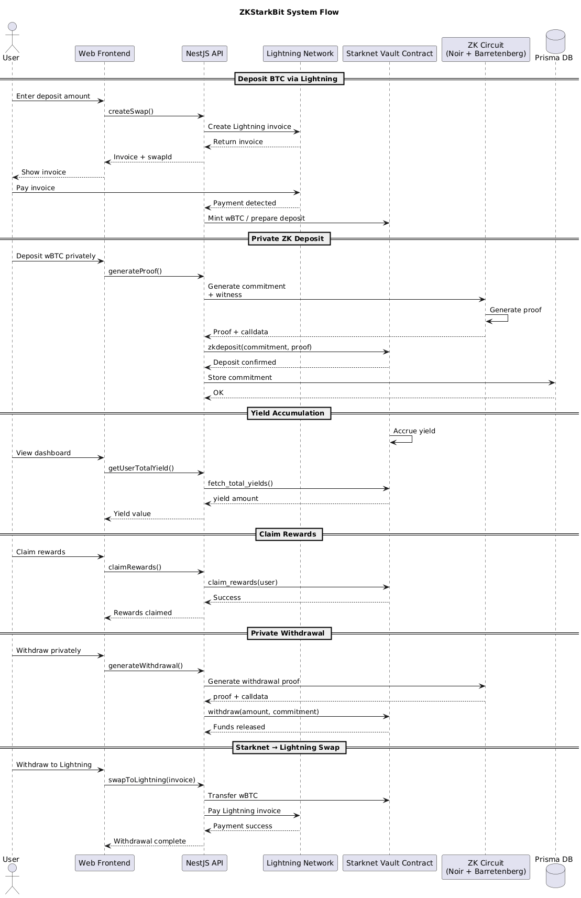

# ZKStarkBit — Setup Guide

<p align="center">
  
</p>

This repository contains the full stack implementation for **ZKStarkBit**, a privacy‑preserving Bitcoin ↔ Starknet liquidity system using **Lightning swaps and zero‑knowledge proofs**.

This README explains how to set up and run the project locally.

---

# Repository Structure

The project is divided into several main components:

```
.
├── api        # NestJS backend handling swaps, proofs, and Starknet interactions
├── circuit    # Noir zk‑circuits used to generate deposit and withdrawal proofs
├── contract   # Starknet smart contracts (vault + verifier)
├── web        # React frontend
├── build      # Circuit build artifacts
├── calldata.txt
└── testnodejs # small node test utilities
```

---

# System Architecture

The system consists of four main layers:

1. **Frontend (web)** — React UI for interacting with swaps and vaults
2. **Backend (api)** — NestJS service coordinating swaps and zk‑proofs
3. **Zero‑Knowledge Circuits (circuit)** — Noir circuits generating proofs
4. **Smart Contracts (contract)** — Starknet contracts verifying proofs and managing vault logic

---

# Prerequisites

Install the following before running the project.

### Node.js

```
Node >= 18
```

### Python (for zk tooling)

Python is required for some proof tooling.

```
python3.10
python3.10-venv
```

Create a virtual environment:

```
python3.10 -m venv ~/.venvs/venv310
source ~/.venvs/venv310/bin/activate
```

---

# Install Zero Knowledge Tooling

Install Noir and proving tools.

### Install Nargo (Noir)

```
curl -L https://raw.githubusercontent.com/noir-lang/noirup/main/install | bash
noirup --version 1.0.0-beta.1
```

### Install Barretenberg

Used for generating Ultra Honk proofs.

```
bbup --version 0.67.0
```

### Install Garaga

Garaga is used to generate calldata for Starknet verifier contracts.

---

# Project Setup

Clone the repository.

```
git clone https://github.com/vicjuma/Redefine-Hackathon-Final-Submission.git
cd Redefine-Hackathon-Final-Submission
```

---

# 1. Backend Setup (api)

Navigate to the backend directory.

```
cd api
```

Install dependencies:

```
pnpm install
```

Run database migrations:

```
npx prisma migrate dev
```

Start the backend server:

```
npm run start:dev
```

The backend is responsible for:

- Lightning swaps
- zk proof generation
- Starknet interactions
- deposit tracking

---

# 2. Zero Knowledge Circuit Setup (circuit)

Navigate to the circuit directory.

```
cd circuit
```

Project structure:

```
circuit
├── src
├── target
├── Prover.toml
├── ProverWithdraw.toml
└── Nargo.toml
```

Compile the circuit:

```
nargo compile
```

Generate witness:

```
nargo execute witness
```

Generate proof:

```
bb prove_ultra_keccak_honk \
 -b ./target/circuit.json \
 -w ./target/witness.gz \
 -o ./target/proof
```

Generate verification key:

```
bb write_vk_ultra_keccak_honk \
 -b ./target/circuit.json \
 -o ./target/vk
```

Generate Starknet calldata:

```
garaga calldata \
 --system ultra_keccak_honk \
 --vk ./target/vk \
 --proof ./target/proof \
 --format array > ../calldata.txt
```

---

# 3. Smart Contract Setup (contract)

Navigate to the contract directory.

```
cd contract
```

Install dependencies:

```
scarb build
```

Deploy contracts to Starknet (Sepolia recommended).

The contracts include:

- Vault contract
- zk proof verifier

---

# 4. Frontend Setup (web)

Navigate to the frontend directory.

```
cd web
```

Install dependencies:

```
npm install
```

Run the development server:

```
npm run dev
```

The frontend will start on:

```
http://localhost:5173
```

---

# Running the Full System

Run the components in the following order:

1️⃣ Backend

```
cd api
npm run start:dev
```

2️⃣ Frontend

```
cd web
npm run dev
```

3️⃣ zk circuits are executed automatically by the backend when generating proofs.

---

# Core Backend Features

The backend implements several major services:

### Lightning → Starknet Swap

```
createSwap()
```

Creates a Lightning invoice and swaps BTC to Starknet wBTC.

---

### Starknet → Lightning Swap

```
swapToLightning()
```

Withdraws funds from Starknet and pays a Lightning invoice.

---

### zk Deposit

```
generateProof()
```

Generates a private deposit commitment and zk proof.

Steps:

1. Create Poseidon commitment
2. Generate witness
3. Generate proof
4. Convert proof to Starknet calldata
5. Execute vault deposit

---

### zk Withdrawal

```
generateWithdrawal()
```

Generates withdrawal proof and executes vault withdrawal.

---

### Yield Tracking

```
getUserTotalYield()
```

Fetches accumulated yield from the Starknet vault.

---

### Claim Rewards

```
claimRewards()
```

Allows users to claim accumulated yield.

---

# Database

Prisma is used to store deposit commitments.

Database file:

```
api/dev.db
```

Schema tracks:

- commitments
- deposit amounts
- yield amounts
- withdrawal status

---

# Example Flow

1️⃣ User swaps BTC → Starknet

2️⃣ User deposits privately

3️⃣ zk proof generated

4️⃣ Vault records commitment

5️⃣ User earns yield

6️⃣ User withdraws privately

7️⃣ User optionally swaps back to Lightning

---

# Important Files

Backend service:

```
api/src/atomiq/atomiq.service.ts
```

Circuit definitions:

```
circuit/src
```

Smart contracts:

```
contract/src
```

Frontend UI:

```
web/src
```

---

# Notes

This project is currently configured for:

- Starknet Sepolia
- Bitcoin Lightning Testnet

Production deployment would require:

- mainnet RPC
- production Lightning nodes

---

# License

MIT
